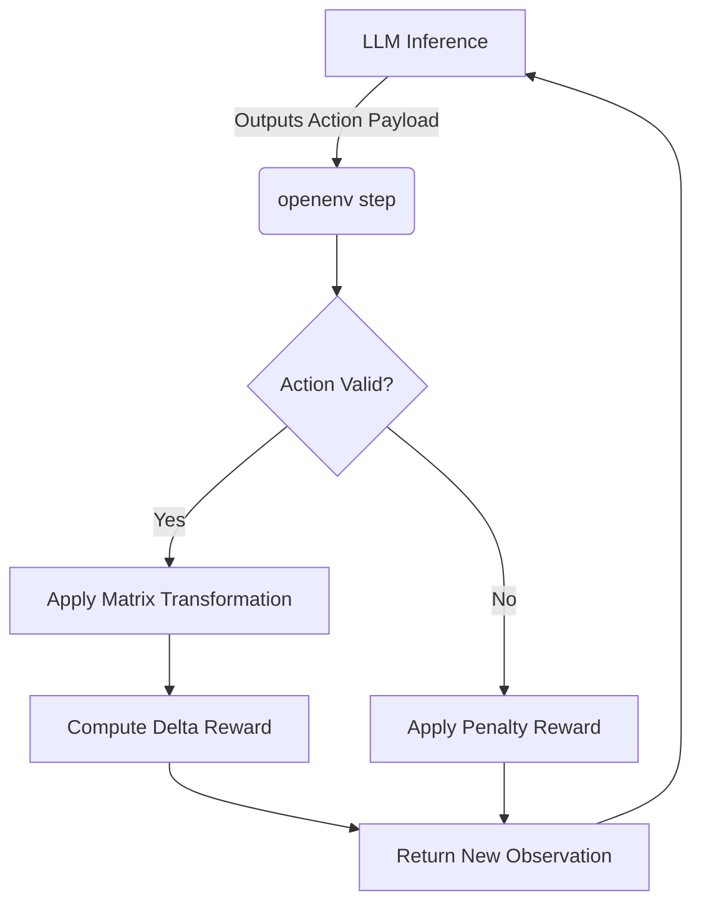

# Architecture Overview

This project is an **LLM Evaluation Framework for Structured Financial Reasoning**, built around the standard OpenEnv specification. It simulates a deterministic environment where an agent interacts with a ledger to categorize and process transactions.

## Core Components

1. **Environment State Machine (`finance_env/`)**
   - The environment provides a stateful `reset()` and `step(action)` loop analogous to standard Reinforcement Learning environments (e.g., Gymnasium).
   - It maintains the `cursor` tracking the active transaction, applying state transitions deterministically based on valid categorizations, split actions, or anomaly flags.
   - Any invalid action (e.g., targeting a non-existent category or skipping a required step) incurs an immediate negative reward and does not advance the state, forcing the agent to retry or fail gracefully.

2. **Strict Typed Schemas (`models.py`)**
   - We utilize Python `Pydantic` models to strictly define the **Observation**, **Action**, and **Reward** schemas.
   - This prevents silent schema drifts and ensures the LLM's outputs can be reliably parsed and validated by the built-in JSON validators.
   - The schemas are fully inspectable via `openenv validate`.

3. **Inference Orchestrator (`inference.py`)**
   - A robust runner utilizing the OpenAI Python Client standard.
   - Operates on a **Structured Standard Output Contract**: Only definitive evaluation payloads (e.g., `[START]`, `[STEP]`, `[END]`) are emitted to `stdout`.
   - All unstructured reasoning, warnings, or raw LLM completions are logged securely to `stderr`. This allows benchmark graders to `grep` purely structured data for evaluation without risking format corruption.

## Security & Data Integrity

A critical architectural decision was the **Answer-Key Firewall**:
- Ground-truth mappings are physically segregated from the Observation object generated during `step()`.
- The agent never receives the correct categories dynamically; it must derive them entirely from the context clues within the `memo`, `amount`, and `merchant` fields.
- The `state()` method returns the full internal ledger (including the answer key) solely for grader processes.

## Workflow Pipeline

